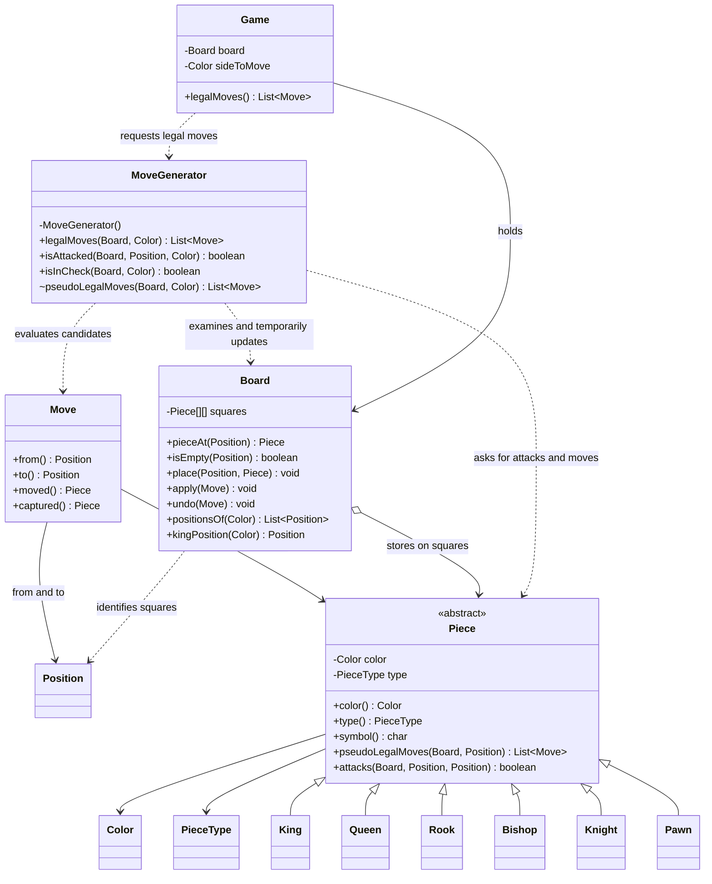
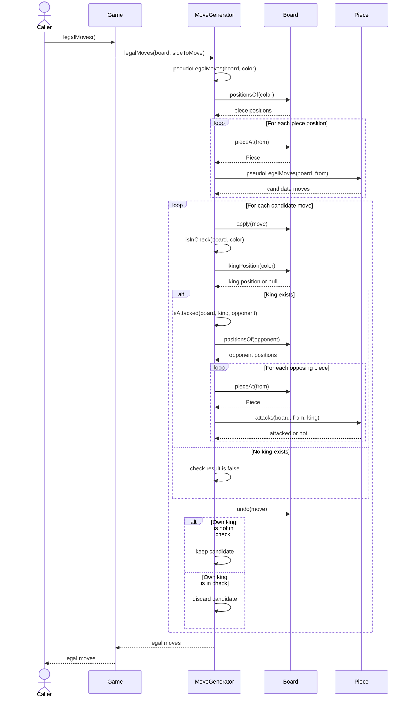

# CSC 413 Chess Engine Design

## Class Diagram

```mermaid
classDiagram
    class Game {
        -Board board
        -Color sideToMove
        +legalMoves() List~Move~
    }

    class MoveGenerator {
        -MoveGenerator()
        +legalMoves(Board, Color) List~Move~
        +isAttacked(Board, Position, Color) boolean
        +isInCheck(Board, Color) boolean
        ~pseudoLegalMoves(Board, Color) List~Move~
    }

    class Board {
        -Piece[][] squares
        +pieceAt(Position) Piece
        +isEmpty(Position) boolean
        +place(Position, Piece) void
        +apply(Move) void
        +undo(Move) void
        +positionsOf(Color) List~Position~
        +kingPosition(Color) Position
    }

    class Move {
        +from() Position
        +to() Position
        +moved() Piece
        +captured() Piece
    }

    class Position
    class Color
    class PieceType

    class Piece {
        <<abstract>>
        -Color color
        -PieceType type
        +color() Color
        +type() PieceType
        +symbol() char
        +pseudoLegalMoves(Board, Position) List~Move~
        +attacks(Board, Position, Position) boolean
    }

    class King
    class Queen
    class Rook
    class Bishop
    class Knight
    class Pawn

    Game --> Board : holds
    Game ..> MoveGenerator : requests legal moves
    MoveGenerator ..> Board : examines and temporarily updates
    MoveGenerator ..> Piece : asks for attacks and moves
    MoveGenerator ..> Move : evaluates candidates
    Board o--> Piece : stores on squares
    Board ..> Position : identifies squares
    Move --> Position : from and to
    Move --> Piece : moved and captured pieces
    Piece --> Color
    Piece --> PieceType

    Piece <|-- King
    Piece <|-- Queen
    Piece <|-- Rook
    Piece <|-- Bishop
    Piece <|-- Knight
    Piece <|-- Pawn
```

## Sequence Diagram

```mermaid
sequenceDiagram
    actor Caller
    participant G as Game
    participant MG as MoveGenerator
    participant B as Board
    participant P as Piece

    Caller->>G: legalMoves()
    G->>MG: legalMoves(board, sideToMove)
    MG->>MG: pseudoLegalMoves(board, color)
    MG->>B: positionsOf(color)
    B-->>MG: piece positions

    loop For each piece position
        MG->>B: pieceAt(from)
        B-->>MG: Piece
        MG->>P: pseudoLegalMoves(board, from)
        P-->>MG: candidate moves
    end

    loop For each candidate move
        MG->>B: apply(move)
        MG->>MG: isInCheck(board, color)
        MG->>B: kingPosition(color)
        B-->>MG: king position or null

        alt King exists
            MG->>MG: isAttacked(board, king, opponent)
            MG->>B: positionsOf(opponent)
            B-->>MG: opponent positions
            loop For each opposing piece
                MG->>B: pieceAt(from)
                B-->>MG: Piece
                MG->>P: attacks(board, from, king)
                P-->>MG: attacked or not
            end
        else No king exists
            MG->>MG: check result is false
        end

        MG->>B: undo(move)

        alt Own king is not in check
            MG->>MG: keep candidate
        else Own king is in check
            MG->>MG: discard candidate
        end
    end

    MG-->>G: legal moves
    G-->>Caller: legal moves
```
